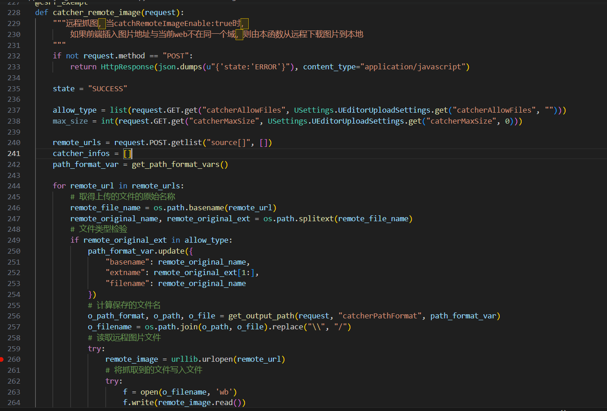

## synopsis
The system does not properly verify the parameters when loading remote images, resulting in a private address can be passed through the website server for request, and the returned content is written into the file for return, resulting in SSRF vulnerability

## detail

The Catcher_remote_image function will obtain the source array using urllib.urlopen for remote call; The remote_url is not protected by filtering, which would allow an attacker to pass in any malicious content and execute a remote load call from within the system. The return result of the call is written to the file for output.

